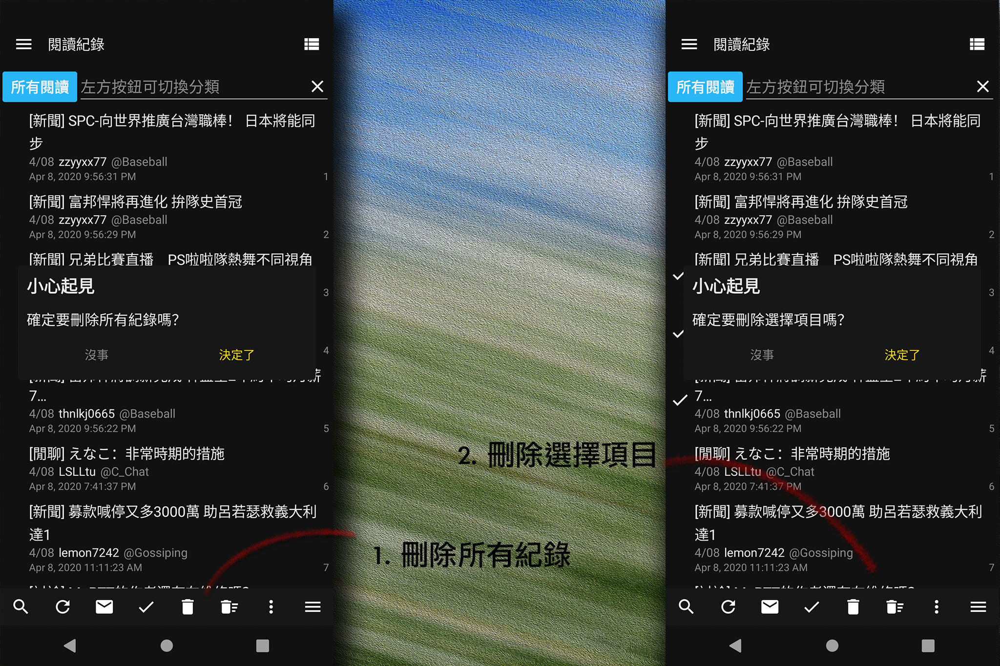

##### o
## 刪除閱讀紀錄

   

1. ### 刪除所有紀錄
點擊後將刪除所有紀錄，若分類為所有閱讀、我的文章、已推文，將會統一刪除所有閱讀紀錄
若為稍後閱讀、追蹤文章分類則僅會刪除該分類底下的所有項目

2. ### 刪除選擇項目
點擊後將刪除已選擇項目，可使用選擇全部功能快速選取或取消選取  
  
[返回首頁](https://kimieno.github.io/android.pitt) 